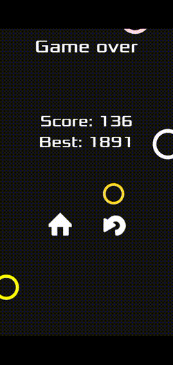

# Jumper

## Sobre o game

baixe o app 👉 

Jumper é um jogo feito na engine  Godot, ele veio de um fork do projeto [kidscancode/circle_jump](https://github.com/kidscancode/circle_jump) que é um tutorial sobre desenvolvimento na godot, eu gostei muito do estilo do jogo e decidi fazer a minha versão com cores diferentes e um sistema de dificuldade diferentes do jogo original, nesse jogo a dificuldade no começo é menor mas ao avançar ele ficara muito difícil, no momento estou trabalhando em adicionar conquistas no jogo e um ranque global.

## Problemas atuais do projeto
Está sendo complicado integrar a Godot com a google  play  services para poder adicionar conquistar e ranque, tem pouco conteúdo sobre e na godot não tem nada oficial sobre.

## Contribua com o projeto
Sinta se a vontade para contribuir com o projeto com código, issues, etc. ...